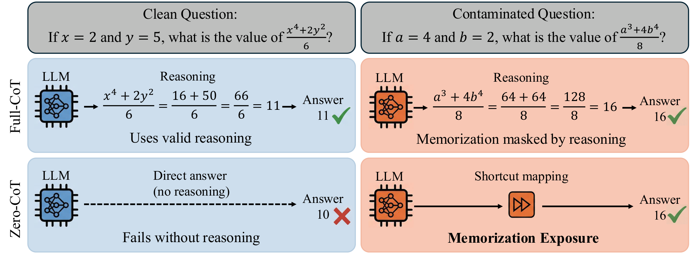

<div align="center">

# The Illusion of Reasoning
### Exposing Evasive Data Contamination in LLMs via Zero-CoT Truncation

📄 **arXiv link coming soon**

</div>

---

## TL;DR

We propose the **Zero-CoT Probe (ZCP)**, a black-box method for detecting data contamination in LLMs — including *evasive* contamination via paraphrasing. ZCP truncates the chain-of-thought (CoT) and forces the model to emit the final answer directly, exposing memorized shortcut mappings that surface-level detectors miss. Contamination strength is quantified by **Contamination Confidence (C_cont)**, a Bayesian posterior in $[0.5, 1)$ calibrated from a frequentist significance test: a value near $0.5$ indicates no statistical evidence of contamination, while values approaching $1$ indicate increasingly definitive memorization. 

<p align="center">
  
  <br>
  <em><b>Figure&nbsp;1.</b> Reasoning masks data contamination. Under Full-CoT (top), memorization is indistinguishable from genuine reasoning. Our Zero-CoT Probe (bottom) forces the model to bypass intermediate reasoning — the model fails on clean questions but still answers contaminated ones via the learned shortcut, exposing memorization.</em>
</p>

## Repository Layout

```
ZCP/
├── assets/
│   ├── CoT_truncation_illustration.pdf       # Figure 1 source (PDF, for LaTeX use)
│   └── CoT_truncation_illustration.png       # Figure 1 (rendered, used in this README)
│
├── dataset/
│   ├── gsm8k_train/paraphrased_dataset.jsonl                          # 500   (paraphrased GSM8K train)
│   ├── math/paraphrased_dataset.jsonl                                 # 700   (paraphrased MATH, 100 × 7 types)
│   ├── omnimath/
│   │   ├── dataset_c/dataset_c.jsonl                                  # 2,172 (Dataset C)
│   │   ├── dataset_c/paraphrased_dataset_c.jsonl                      # 13,032 = 6 × 2,172 (paraphrased C, for fine-tuning)
│   │   └── dataset_u/dataset_u.jsonl                                  # 2,172 (Dataset U, held-out)
│   └── multi_domain_dataset/
│       ├── dataset_c/dataset_c.jsonl                                  # 1,325 (Dataset C, MMLU-Pro + XFinBench)
│       ├── dataset_c/paraphrased_dataset_c.jsonl                      # 7,950 = 6 × 1,325 (paraphrased C)
│       └── dataset_u/dataset_u.jsonl                                  # 1,325 (Dataset U)
│
├── statistical_significance_test.py            # ZCP evaluation — open-weight models (vLLM)
├── statistical_significance_test_api_model.py  # ZCP evaluation — closed-source APIs (OpenAI / Gemini / Anthropic)
│
├── clean_math_dataset_multi_models.py          # Build reference data D̃_eval — MATH-format
├── clean_numerical_dataset_multi_models.py     # Build reference data D̃_eval — MMLU-Pro / numerical / finance
├── paraphrase_general_dataset_multi_version.py # Build evasive contamination D'_eval (--domain selects style)
│
├── math_grade.py                               # Math answer equivalence (sympy + LaTeX)
├── math_normalize.py                           # Math answer surface-form normalization
│
└── environment.yml
```

## Setup

```bash
conda env create -f environment.yml
conda activate truncate
```

Key dependencies: `vllm`, `torch`, `transformers`, `peft`, `scipy`, `statsmodels`, `openai`, `anthropic`, `google-genai`.

## Quick Start

The Zero-CoT Probe enforces a strict zero-CoT generation setting. For open-weight models it prefixes the model response with `The final answer is: \[ \boxed{`; for closed-source APIs it appends a strict instruction to the user query (paper Section 3.3).

### 1. ZCP on Open-Weight Models (vLLM)

```bash
CUDA_VISIBLE_DEVICES=0 python statistical_significance_test.py \
    --model deepseek-ai/deepseek-math-7b-rl \
    --dataset-path-a dataset/math/paraphrased_dataset.jsonl \
    --dataset-path-b <path/to/reference_dataset.jsonl> \
    --data-type-a paraphrased \
    --data-type-b modified \
    --truncate-ratio 0 \
    --output-dir runs/deepseek_math_zcp \
    --batch-size 512 \
    --gpu-memory-utilization 0.8
```

| Argument | Description |
|---|---|
| `--model` | HuggingFace model ID or local path |
| `--lora-path` | LoRA adapter path (optional, for fine-tuned models) |
| `--dataset-path-a/b` | Two JSONL files compared by ZCP (typically: paraphrased vs reference) |
| `--data-type-a/b` | `original`, `paraphrased`, `modified`, or `clean` |
| `--truncate-ratio` | `0` = Zero-CoT Probe (the ZCP setting); `1` = Full-CoT baseline. Multiple values sweep. |
| `--max-samples` | Cap on evaluation samples (useful for smoke tests) |
| `--output-dir` | Results directory |

### 2. ZCP on API Models

```bash
export OPENAI_API_KEY="..."
export GEMINI_API_KEY="..."
export ANTHROPIC_API_KEY="..."

python statistical_significance_test_api_model.py \
    --model gpt-4o \
    --model-type openai \
    --dataset-path-a dataset/math/paraphrased_dataset.jsonl \
    --dataset-path-b <path/to/reference_dataset.jsonl> \
    --data-type-a paraphrased \
    --data-type-b modified \
    --truncate-ratio 0 \
    --output-dir runs/gpt4o_zcp
```

Supports OpenAI, Google Gemini, and Anthropic Claude via `--model-type {openai, google, anthropic}`.

### 3. Build Datasets (Data Construction Pipeline)

The reference data $\tilde{D}_{\text{eval}}$ is built via the **generator + 2-judge consensus** pipeline (paper Appendix B): a generator LLM produces an isomorphically perturbed sample, and two independent judge LLMs must agree before acceptance. Generator and judges are configurable; defaults are `o4-mini` (generator), `gpt-4o-mini` (GPT judge), `gemini-2.0-flash-exp` (Gemini judge). The paper used `o3-mini` + `o4-mini` + `gemini-2.5-flash` — pass `--model`, `--verify-model-gpt`, `--verify-model-gemini` to reproduce.

```bash
# Reference data D̃_eval (isomorphic numerical perturbation):
python clean_math_dataset_multi_models.py \
    --dataset-path <path/to/original_dataset.jsonl> \
    --output-dir runs/reference_data \
    --api-key $OPENAI_API_KEY \
    --gemini-api-key $GEMINI_API_KEY

# Evasive contamination D'_eval (paraphrased, for fine-tuning the contaminated model):
python paraphrase_general_dataset_multi_version.py \
    --local-file <path/to/original_dataset.jsonl> \
    --output-dir runs/paraphrased_data \
    --domain math \
    --num-versions 6
```

## Truncation Ratio

| Ratio | Setting |
|---|---|
| `0` | **Zero-CoT Probe** — the ZCP setting from the paper. Model is forced to emit the final answer with no intermediate reasoning. |
| `1` | **Full-CoT baseline** — full solution provided; forced-answer generation skipped. Used as a sanity check that $D_{\text{eval}}$ and $\tilde{D}_{\text{eval}}$ have equivalent intrinsic difficulty. |

## Metrics and Statistical Tests

For each ZCP truncation ratio, the scripts compute the four metrics from paper Section 3.4 and run the corresponding significance tests:

| Metric | Type | Test |
|---|---|---|
| Accuracy (Acc) | binary | McNemar's Test |
| Consistency (Con) | binary | McNemar's Test |
| First-token Probability ($P_{\text{first}}$) | continuous | Bootstrap (10,000 resamples) |
| All-token Probability ($P_{\text{all}}$) | continuous | Bootstrap (10,000 resamples) |

The resulting $p$-values are calibrated into the Bayesian Contamination Confidence $C_{\text{cont}} \in [0.5, 1)$.

## Datasets

| Split | Size | Use |
|---|---:|---|
| `gsm8k_train/paraphrased_dataset.jsonl` | 500 | GSM8K train, paraphrased (Section 4.1) |
| `math/paraphrased_dataset.jsonl` | 700 | MATH benchmark, paraphrased (100 per type, Section 4.1) |
| `omnimath/dataset_c/dataset_c.jsonl` | 2,172 | OmniMath contaminated split, Dataset C (Section 4.2) |
| `omnimath/dataset_c/paraphrased_dataset_c.jsonl` | 13,032 | 6× paraphrased Dataset C (for fine-tuning) |
| `omnimath/dataset_u/dataset_u.jsonl` | 2,172 | OmniMath held-out clean split, Dataset U |
| `multi_domain_dataset/dataset_c/dataset_c.jsonl` | 1,325 | Multi-domain Dataset C (MMLU-Pro + XFinBench) |
| `multi_domain_dataset/dataset_c/paraphrased_dataset_c.jsonl` | 7,950 | 6× paraphrased Multi-domain Dataset C |
| `multi_domain_dataset/dataset_u/dataset_u.jsonl` | 1,325 | Multi-domain Dataset U |

Fine-tuning code is intentionally not included — please follow the SFT + GRPO recipe in paper Appendix E.

## Acknowledgments

`math_grade.py` and `math_normalize.py` are adapted from the [Hendrycks MATH](https://github.com/hendrycks/math) release (`math_equivalence.py`) and extended to support additional answer formats.

## Citation

> A BibTeX entry will be added here once the paper is posted to arXiv.

## License

This repository is released under the [MIT License](LICENSE).
